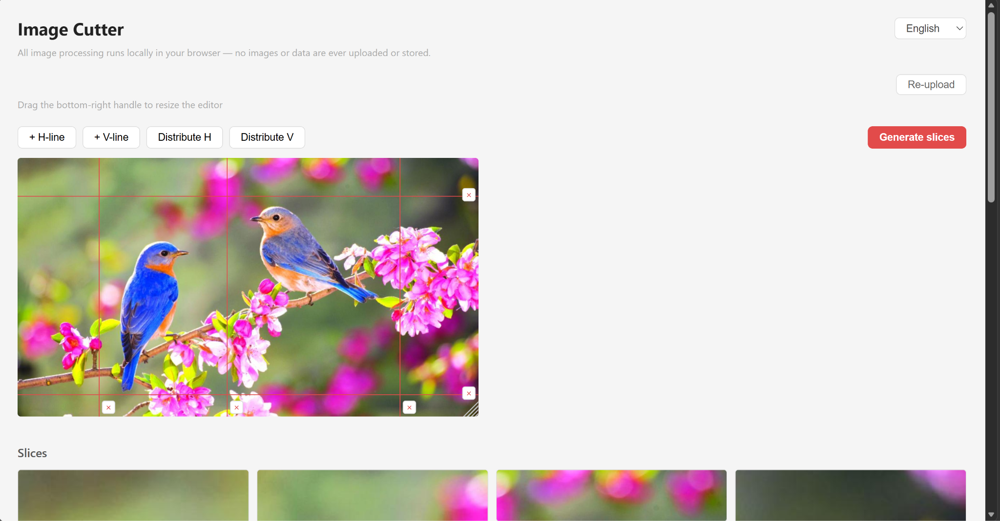
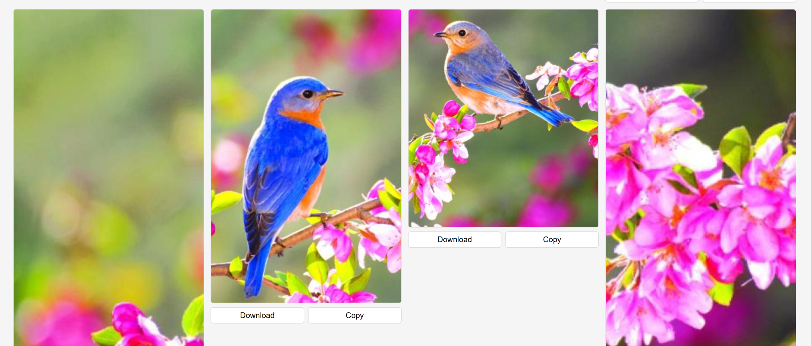

# Image Cutter

A very simple tool for cropping images.

**Live:** [https://your-project.pages.dev](https://your-project.pages.dev)

---

## Usage

1. Open the page and import an image by clicking, dragging, or pasting (Ctrl+V).
2. Add horizontal and vertical cut lines using the toolbar buttons. Lines can be dragged to any position and deleted with the × button.
3. Use **Distribute H / V** to space lines evenly.
4. Drag the bottom-right handle of the editor to resize the canvas.



5. Click **Generate slices** to crop. Results appear below as a grid. Each slice can be downloaded or copied to clipboard.



**Languages supported:** English · 中文 · Español · Français · Català · 日本語

---

## Development

**Stack:** React 18 + Vite, CSS Modules, no external runtime dependencies.

**How it works:**

- Cut line positions are stored as decimal percentages (3 d.p.) relative to the image dimensions, keeping display size and crop coordinates independent.
- The SVG overlay is sized to match the displayed image. Each line has a 16 px transparent hitbox for easier dragging.
- Cropping runs on a hidden `<canvas>` using `drawImage` against the original full-resolution image, then exports each slice via `toDataURL`.
- i18n is a plain React Context with a `t(key)` lookup — no library.

```
npm install
npm run dev
npm run build   # output → dist/
```
